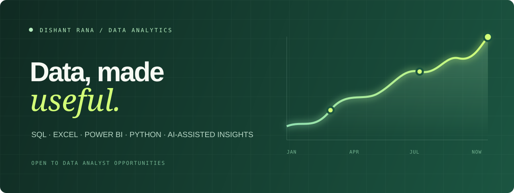

  

  
  
  

## Hi, I'm Dishant

I'm an aspiring **Data Analyst** based in Delhi NCR. I use SQL, Excel, Power BI, Python, and thoughtful AI-assisted workflows to turn messy data into clear business decisions.

My background in Liberal Arts has trained me to ask strong questions, communicate clearly, and look at a problem from more than one angle. Now I apply that perspective to data: finding the story, testing the details, and making the next step easier to see.

> **Currently open to:** Data Analyst · MIS Analyst · Reporting Analyst · Business Analyst · Data Analytics Intern roles

## What I'm focused on

| | |
|:--|:--|
| **Dashboards** | Building useful reports with Excel and Power BI |
| **Analysis** | Exploring real business data with SQL and Python |
| **AI + data** | Using AI responsibly for faster exploration and clearer insight synthesis |
| **Portfolio** | Publishing end-to-end projects that show the work, not just the result |

## Toolkit

  
  
  
  
  
  
  
  
  

## Featured work

| Project | What it shows | Tools |
|:--|:--|:--|
| [**AI-Powered Revenue Intelligence Agent**](https://github.com/dishant1305-star/AI-Powered-Revenue-Intelligence-Agent) | An end-to-end revenue intelligence system that brings analytics and AI together. | Jupyter Notebook, AI, Analytics |
| [**Ecommerce Sales & Profit Analysis**](https://github.com/dishant1305-star/Ecommerce-Sales-Profit-Analysis) | An end-to-end EDA of 9,994 Superstore orders covering monthly sales trends, category & sub-category performance, profit analysis, and segment-level Sales-to-Profit ratios. Solved all 7 deliverables of the iScale Data Analytics assignment. | Python, Pandas, Plotly, Jupyter |
| [**Database SQL**](https://github.com/dishant1305-star/Database_SQL) | A structured, step-by-step SQL guide covering foundations through joins, subqueries, indexes, stored procedures, and transactions. | SQL, MySQL |

### In the pipeline

- **Sales Performance Dashboard** — Power BI dashboard focused on revenue, profitability, products, and regional KPIs.
- **Customer Churn Study** — A data-cleaning and exploratory-analysis project translating churn patterns into practical actions.

## Learning in public

- Completed the **Deloitte Australia Data Analytics Job Simulation**
- Completed the **Tata GenAI Powered Data Analytics Job Simulation**
- Completed the **iScale Data Analytics Assignment** — 7/7 requirements delivered
- Building a practical body of work around data cleaning, EDA, reporting, and dashboarding

## Let's connect

If you are hiring for an entry-level analytics role, know of a relevant opportunity, or simply want to talk about data, I would be glad to connect.

  <a href="mailto:dishant1305@gmail.com">Email me</a> &nbsp;·&nbsp;
  <a href="https://www.linkedin.com/in/dishant-rana-aaa195389">Connect on LinkedIn</a>

 

<i>Good analysis makes the next decision easier.</i>
